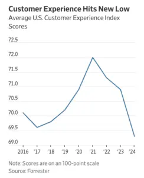

Tämä artikkeli on kirjoitettu ja kuvitettu tekoälyavusteisesti. Alkuperäinen The Wall Street Journalin kirjoitus [löytyy täältä.](https://www.wsj.com/articles/customer-experience-gets-worse-again-23774dff) 

Amerikkalaisten yritysten tuottama asiakaskokemus on laskenut uuteen pohjalukemaan kolmantena peräkkäisenä vuotena, kertoo tutkimusyhtiö Forresterin tuore raportti. Tutkimuksessa arvioitiin 98 363 kuluttajan käsityksiä 223 brändistä 13 eri toimialalta.

Asiakaskokemuksen keskiarvopistemäärä laski 69.3 pisteeseen sadasta, mikä on alin taso Forresterin CX Index -tutkimuksissa sitten vuoden 2017. Luku on laskenut tasaisesti vuodesta 2021 jolloin se oli korkeimmillaan. Vuodesta 2017 alkaen CX Index luku oli kasvussa aina vuoteen 2021 asti kunnes alamäki alkoi. Koronapandemian tuottamat haasteet, kuten toimitusviivästykset, tuotteiden huono saatavuus ja alimitoitetut henkilöstöresurssit, eivät enää selitä alamäkeä. Yritykset jatkavat hintojen nostamistaan ja piilokulujen lisäämistään mikä puolestaan tekee kuluttajista aiempaa skeptisempiä, kertoo Forresterin pääanalyytikko Pete Jacques.

> "Joku maksaa enemmän, mutta he eivät tunne sitä arvoa, jonka he uskovat korkeamman hinnan tuovan mukanaan", Jacques sanoi.

Samalla monet yritykset, jotka pyrkivät parantamaan asiakaskokemustaan, epäröivät eivätkö uskalla käyttää tarvittavia resursseja ja rahaa kehitystyöhön. Yleisesti ottaen muodikkaat asiakaspalvelu-chatbotit, jotka hyödyntävät generatiivista tekoälyä, eivät paranna asiakaskokemusta siten kun oli odotettu.

> "Olisi pitänyt tehdä enemmän testausta, kokeiluja ja suunnittelutyötä ennen kuin näitä toimia tuodaan kuluttajien eteen", Jacques sanoi.

Lemmikkieläinten hoitopalvelu Chewy säilytti Forresterin rankingin kärkipaikan jo kolmatta vuotta peräkkäin, vaikka sen pistemäärä laskikin 81.2 aiemmasta 84.2. Muita korkeita pisteitä saaneita olivat muun muassa sähköautovalmistaja Tesla, joka paransi suoritustaan merkittävästi, sekä rahoituspalveluyritykset Navy Federal Credit Union ja USAA. Huonoimmaksi sijoittui Internal Revenue Service (IRS) pistemäärällä 49.6, mikä on hieman alhaisempi kuin edellisvuoden 50 pistettä, vaikka sen ilmainen sähköinen veroilmoitusjärjestelmä sai kohtalaisen hyvää palautetta kokeiluvaiheessa. IRS:n edustaja Kertoi, että virasto teki useita parannuksia vuoden 2024 veroilmoituskautta varten, mm kehittämällä puhelinpalveluaan, lyhentämällä vastausaikojaan ja tarjoamalla aiempaa enemmän henkilökohtaista palvelua. Muita "erittäin huonoja" kategoriaan kuuluvia brändejä, joiden pisteet olivat 0-54 välillä, olivat USAJOBS.gov, Yhdysvaltain hallituksen virallinen työnhakuverkkosivusto, sekä energiayhtiö PG&E.

> "Hyvä uutinen on se, että suurimmaksi osaksi kyseessä on siirtyminen positiivisesta neutraaliin suuntaan - raportin yleistuloksia. "Yritykset eivät täysin unohda tehtäviään ja epäonnistu asiakaskokemuksessaan", kommentoi Jacques.

Mikki Aalto-Ylevä + ChatGPT 0408698887 mikki@goodside.fi